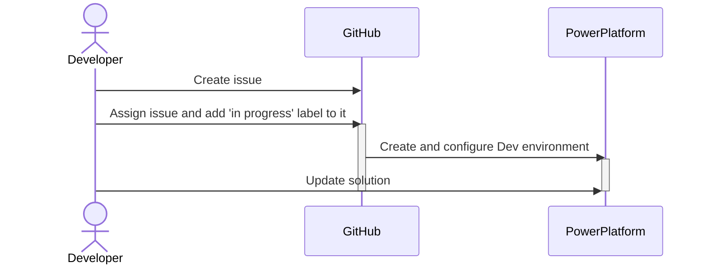

    <h1 align="center">
        What are the principles of the ALM strategy proposed in this repository?
    </h1>

## Overview of the ALM strategy

## Solution versioning

> **Note:** Proposition based on the fact that a concatenation of the date (*yyyymmdd*) and the workflow run id for the patch part of the version we quickly reach some limitations on Power Platform solution versioning.

| Phase                                                                                     | Format             | Notes                                                                                                                                                        |
| ----------------------------------------------------------------------------------------- | ------------------ | ------------------------------------------------------------------------------------------------------------------------------------------------------------ |
| [Development workspace initialization](../.github/workflows/workspace-initialization.yml) | 1.yyyymmdd.xxx     | with   - `yyyymmdd` the current date   - `xxx` the **github.run_number**                                                                             |
| [Import solution to validation](../.github/workflows/import-solution-to-validation.yml)   | 1.yyyymmdd.xxx     | with   - `yyyymmdd` the current date   - `xxx` the **github.run_number**                                                                             |
| [Create and deploy release](../.github/workflows/create-deploy-release.yml)               | major.yyyymmdd.xxx | with   - `major` a major version provided as input when running the workflow   - `yyyymmdd` the current date   - `xxx` the **github.run_number** |